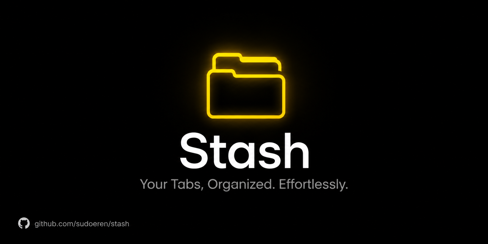

# Stash

**Your Tabs, Organized. Effortlessly.**

---

## Overview

**Stash** is a lightweight Google Chrome extension designed to enhance productivity by streamlining tab management. It allows users to instantly archive active browsing sessions, organize them intelligently, and restore them with ease. By reducing browser clutter and memory usage, Stash helps maintain a focused and efficient workflow.

---

## Visual Preview

  

---

## Key Features

| Feature | Description |
| :--- | :--- |
| **Instant Session Archiving** | Securely save all open tabs in the current window with a single interaction, preserving your workflow for later. |
| **Intelligent Organization** | Saved sessions are automatically grouped by date and time, ensuring structured and easy retrieval of past research or tasks. |
| **Advanced Search Capabilities** | Quickly locate specific tabs, domains, or session groups using the integrated real-time search functionality. |
| **Priority Management** | Mark critical sessions as "Favorites" to keep frequently accessed tabs readily available at the top of your dashboard. |
| **Adaptive User Interface** | Features a modern, responsive design with full support for both Light and Dark themes to match your system preferences. |
| **Data Persistence & Portability** | Includes robust backup options, allowing users to export and import session data via JSON for safekeeping or transfer between devices. |
| **Keyboard Accessibility** | Optimized for power users with global keyboard shortcuts (default: `Alt+Shift+S`) for immediate session saving. |

---

## Installation Guide

To install the extension manually in developer mode, please follow these steps:

1.  Open Google Chrome and navigate to `chrome://extensions`.
2.  Enable the **Developer mode** toggle switch located in the top-right corner of the page.
3.  Click the **Load unpacked** button that appears in the top-left menu.
4.  Select the root directory containing the Stash extension files.
5.  The extension will be installed and appear in your toolbar.

---

## Usage Instructions

| Interface | Action |
| :--- | :--- |
| **Extension Popup** | Click the Stash icon in the browser toolbar and select **Save All** to archive the current window's tabs. |
| **Keyboard Shortcut** | Press `Alt + Shift + S` to instantly trigger the save action without leaving your keyboard. |
| **Dashboard** | Open a new tab or click "My Stash" to view, search, restore, or manage your saved sessions. |

---

Distributed under the [MIT License](LICENSE).

