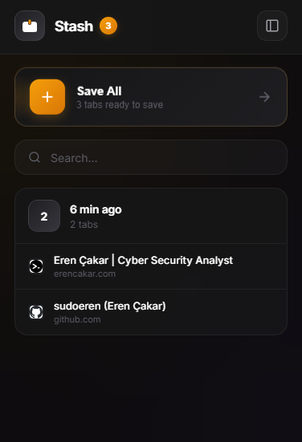

# Stash

**Save your tabs. Free your mind.**

---

## Screenshots

  <h3>Popup View</h3>
  
    
  <h3>Dashboard View</h3>
  

---

## Features

⚡ **One-Click Save** — Save all tabs instantly  
📂 **Smart Groups** — Auto date/time organization  
🔍 **Quick Search** — Find any saved tab  
⭐ **Favorites** — Mark important groups  
🌓 **Themes** — Light & dark mode  
💾 **Backup** — JSON import/export  
⌨️ **Shortcut** — `Alt+Shift+S`

---

## Install

1. Go to `chrome://extensions`
2. Enable **Developer mode**
3. Click **Load unpacked** → Select folder
4. Done 🎉

---

## Usage

| Method | Action |
|--------|--------|
| **Popup** | Click icon → Save All |
| **Keyboard** | `Alt + Shift + S` |
| **Right Click** | Use Stash menu |

---

## Tech

`Chrome Extension` `Manifest V3` `Vanilla JS` `Storage API`

---

**Eren Çakar** · [@sudoeren](https://github.com/sudoeren)

MIT © 2025

