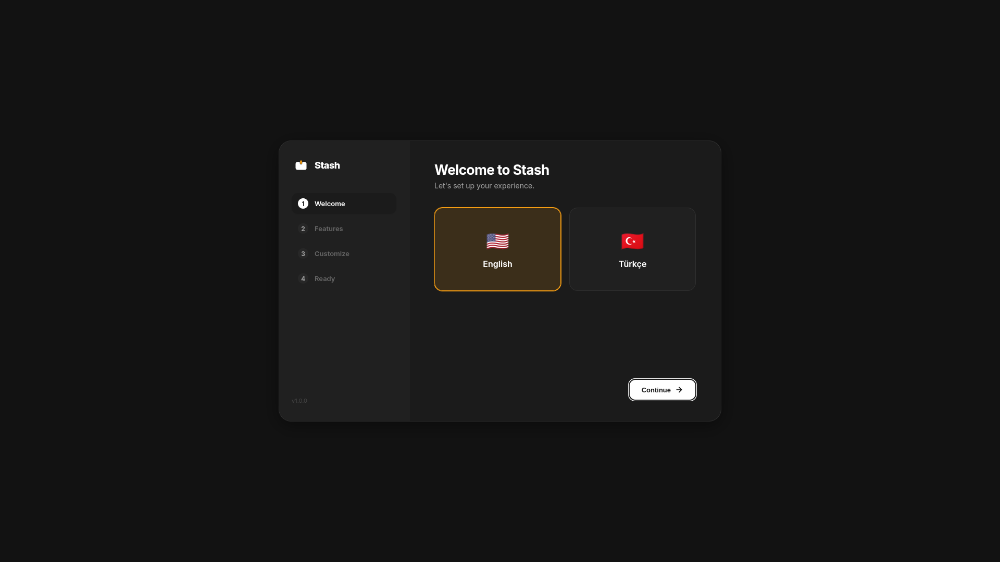
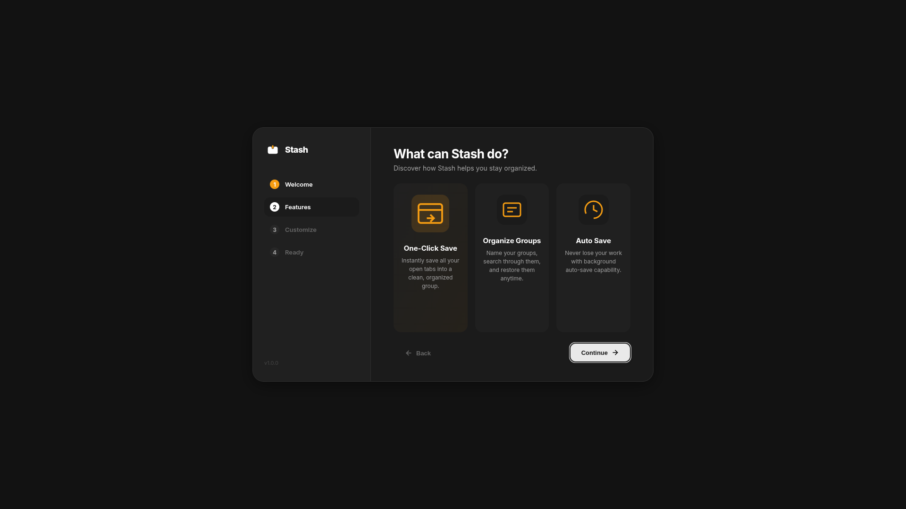
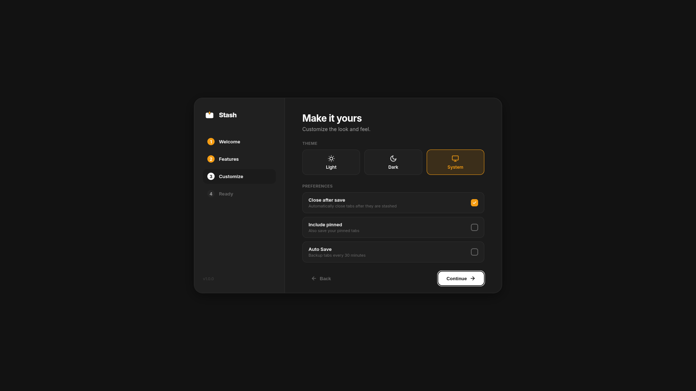
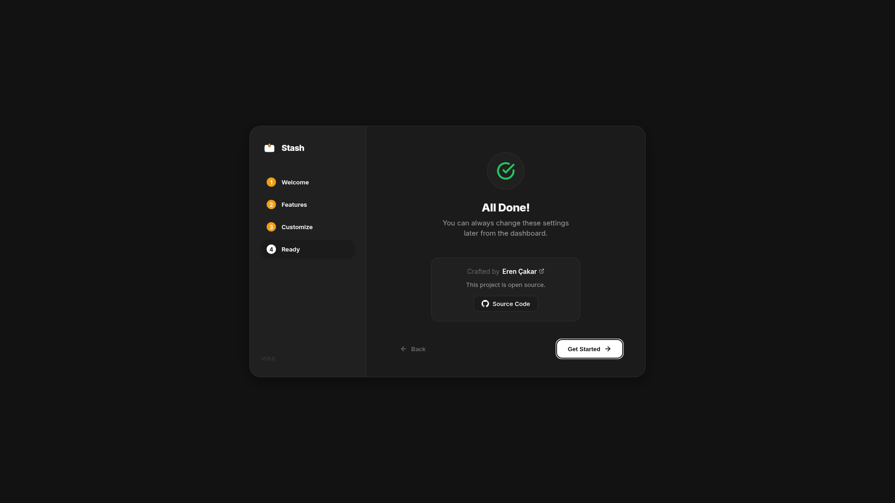
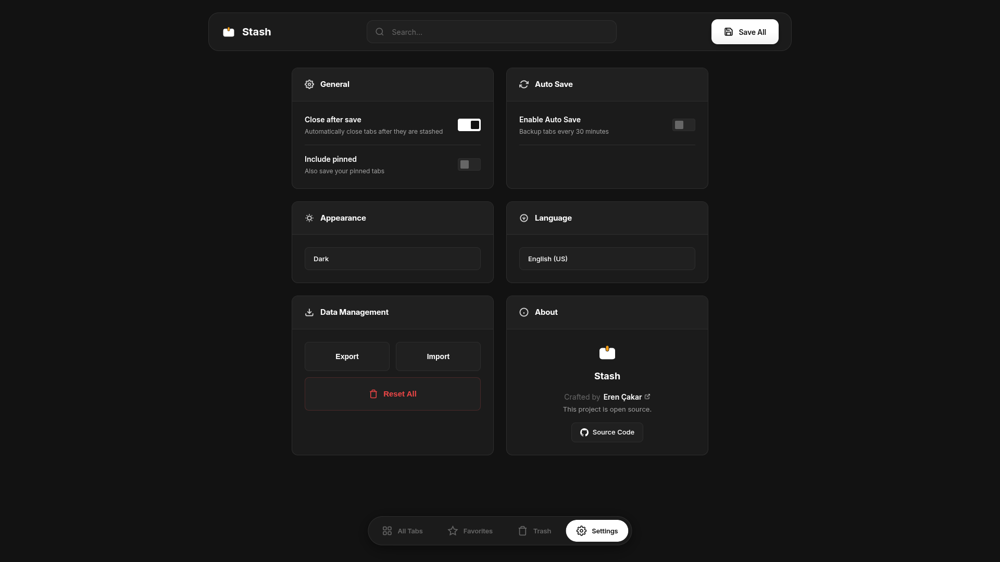

# Stash 

Save your tabs with one click. Minimal and fast.

Lightweight Chrome extension to archive open tabs and restore them later. Reduces clutter and memory usage.

**Features:** one-click save, grouped by date, instant search, favorites, light/dark theme, JSON backup, shortcut `Alt+Shift+S`.

### Screenshots

**Onboarding**

   

**Popup** | **Settings**

 

### Installation

Get the code first, then load it in Chrome:

**1. Download**
- Open https://github.com/sudoeren/stash, click Code > Download ZIP, then extract the ZIP

**2. Load in Chrome**
1. Open `chrome://extensions`
2. Enable **Developer mode** top right
3. Click **Load unpacked** and select the `stash` folder you just downloaded
4. Pin Stash to the toolbar

### Usage

Click the Stash icon and hit **Save All**, or press `Alt+Shift+S`. Open **My Stash** from the popup to view, search, restore or delete sessions.

MIT License - see [LICENSE](LICENSE).
