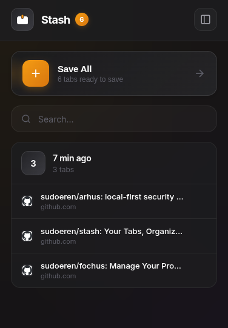
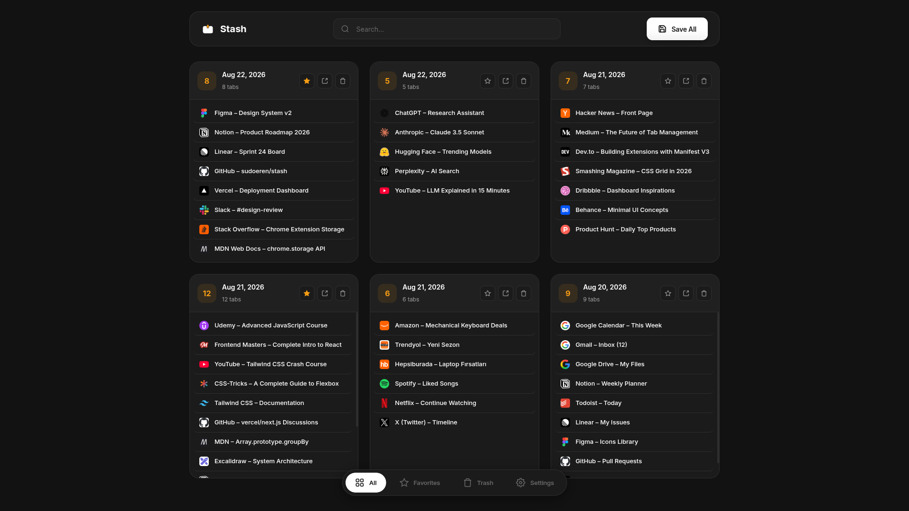

  

# Stash

Save your tabs with one click. Minimal and fast.

Lightweight Chrome extension to archive open tabs and restore them later. Reduces clutter and memory usage.

<table>
<tr>
<td width="58%" valign="top">

**Features**

- one-click save for all tabs, or single tab via context menu
- grouped by date, collapsible cards
- drag and drop to reorder tabs and move between groups
- instant search by title, domain or URL
- favorites pinned to the top
- trash with restore and auto cleanup after 30 days
- auto save at custom interval
- light, dark and system theme
- JSON export and import for backup
- keyboard shortcut `Alt+Shift+S`

</td>
<td width="42%" align="center" valign="top">

Popup

</td>
</tr>
</table>

### Home

### Installation

**1. Download**
- Open https://github.com/sudoeren/stash, click Code > Download ZIP, then extract the ZIP

**2. Load in Chrome**
1. Open `chrome://extensions`
2. Enable **Developer mode** top right
3. Click **Load unpacked** and select the `stash` folder you just downloaded
4. Pin Stash to the toolbar

### Usage

Click the Stash icon and hit **Save All**, or press `Alt+Shift+S`. Open **My Stash** from the popup to view, search, restore or delete sessions.

### License

MIT License - see [LICENSE](LICENSE).
